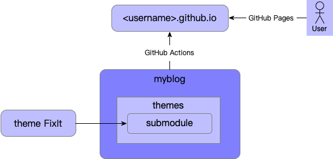

Hugo[[1]]是一个用 go 语言编写的开源[[2]]网站构建框架，截止目前GitHub星数超过70k，它具有功能强大的模板系统、丰富的主题、完善的文档以及全平台支持的客户端，提供开箱即用的分类系统、评论系统、代码高亮、多语言支持等功能，非常适合用来搭建博客网站。

在本地撰写阶段，借助 Hugo 内置服务器可以做到毫秒级热更新，实现所见即所得。同时，得益于 Hugo 采用静态站点生成[[3]]的架构，Hugo 站点可以很容易的部署到各种 HTTP 服务器，且通过本地预览即可确认线上部署效果。

基于成本和使用习惯考虑，选择使用 GitHub Pages 进行部署，并且根据功能不同进行仓库拆分。话不多说，来开始吧。

## 环境安装
Hugo 分为标准和扩展两个版本，扩展版支持 WebP 图像处理以及 Dart Sass，这里我们选择安装扩展版本。

参考官方安装指南[[4]]，前置准备需要安装 Git、Go 和 Dart Sass [[5]]，mac系统可直接使用 homebrew 进行安装，我的电脑上 Git 和 Go 已经安装好，只需要安装 Dart Sass：
```shell
# 添加 tap 源
$ brew tap sass/sass
# 安装 Dart Sass
$ brew install sass/sass/sass
# 验证
$ sass --version
1.69.5
```
安装 Hugo：
```shell
# Hugo 安装
$ brew install hugo
# 验证
$ hugo version
hugo v0.120.4-f11bca5fec2ebb3a02727fb2a5cfb08da96fd9df+extended darwin/arm64 BuildDate=2023-11-08T11:18:07Z VendorInfo=brew
```
可以看到 hugo 版本信息中包含 +extended 信息，说明安装的是 Hugo 扩展版。

## 博客创建
从 Hugo 主题站[[6]]挑选自己喜欢的主题，大多数主题都有 demo 可以体验，我选的是 [FixIt](https://themes.gohugo.io/themes/fixit/)。

### GitHub 仓库准备
接下来创建三个 GitHub 仓库：
1. GitHub Pages 仓库 \<username\>.github.io：GitHub Pages 仓库，仓库名前缀必须使用用户名，必须为公开仓库，用于博客部署。
2. 博客仓库 myblog：私有仓库，名称可自定义，用于存储博客源代码，包括文章和配置。
3. 主题仓库 FixIt：从 FixIt 源代码库[[7]] fork，用于自定义配置主题，另外我 fork 过来后将默认分支从 master 重命名成了 main。

三个仓库的关系如图所示：



博客仓库将主题以 submodule 的形式导入到 themes 文件夹，通过配置文件指定使用的主题；当博客仓库的代码提交到 main 分支时，会触发 GitHub Actions 将 Hugo 构建好的静态站点文件部署到 GitHub Pages 仓库，用户即可通过 GitHub Pages 域名进行博客访问。

三个仓库中，只有 GitHub pages 仓库是必须的，如果不在意博客内容和源代码隐私性，可以去掉 myblog 仓库，将博客源代码存储到 \<username\>.github.io 仓库中，GitHub Pages 支持使用特定分支（默认是 gh-pages）部署。如果不准备自定义修改主题，可以去掉 FixIt 仓库，直接使用官方源代码仓库或者通过 Hugo module 进行主题安装。

### 博客站点创建
仓库准备好之后，可以通过 Hugo 命令行工具[[8]]快速创建站点，Hugo 默认使用 toml 格式配置，同时支持 yaml 和 json，我的博客使用 yaml：
```shell
$ hugo new site --format yaml myblog
# 切换到博客仓库目录
$ cd myblog

# 初始化 git 仓库
$ git init
$ git add .
$ git commit -m "feat: init hugo site"

# 绑定远程博客仓库
$ git remote add origin git@github.com:will4j/myblog.git
$ git push -u origin main

# 增加主题子模块
# 这里因为 fork 主题仓库跟博客仓库在同一目录下，采用相对路径引入
$ git submodule add ../FixIt.git themes/FixIt

# 设置主题
$ echo "theme: FixIt" >> hugo.yaml
$ cat hugo.yaml
baseURL: https://example.org/
languageCode: en-us
title: My New Hugo Site
theme: FixIt
```

Hugo 默认的站点目录结构[[9]]如下：
+ archetypes：原型目录，用于定义各种类型的内容模板。
+ assets：资产目录，用于放置 CSS，JavaScript 等全局资源库。
+ config：配置文件目录，主配置文件 hugo.yaml，支持多文件配置、多环境配置[[10]]。
+ content：内容目录，用于放置文章、分类、标签等内容页面。
+ data：数据目录，用于存取自定义配置数据。
+ i18n：国际化目录，用于页面文本的多语言翻译。
+ layouts：布局目录，用于放置 html 模板。
+ public：部署目录，用于存放 Hugo 构建的静态站点文件。
+ resources：资源目录，包含 Hugo 资产构建流水线产生的可缓存文件，如 CSS、图片等。
+ static：静态资源目录，该目录下的文件会被直接拷贝到站点根目录。
+ themes：主题目录，包含 Hugo 站点可以使用的主题。

可通过 Hugo mounts 配置[[11]]自定义站点目录结构。

### 文章创建及预览
Hugo 支持 Page bundles [[12]]模式，即文章内容打包在一个文件夹下，内部可以独立包含图片、子页面等静态资源，文章以 index.md 作为入口，FixIt 主题已经提供了对应模板，可快速创建文章：
```shell
# 创建 Page bundles 文章
$ hugo new content --kind post-bundle posts/hello-world
# 文章目录结构
$ tree content/posts/hello-world
content/posts/hello-world
├── images
└── index.md
```
查看生成的 index.md 文件，会发现

## 主题配置

## 参考资料
\[1\]: [Hugo 官方文档：What is Hugo][1]  
\[2\]: [GitHub: Hugo 源代码仓库][2]  
\[3\]: [Hugo 官方文档：Benefits of static site generators][3]  
\[4\]: [Hugo 官方文档：Installation][4]  
\[5\]: [Hugo 官方文档：Transpile Sass to CSS][5]  
\[6\]: [Hugo 官方文档：Hugo 主题站][6]  
\[7\]: [GitHub: FixIt 源代码仓库][7]  
\[8\]: [Hugo 官方文档：Hugo 命令行工具][8]  
\[9\]: [Hugo 官方文档：Hugo 目录结构][9]  
\[10\]: [Hugo 官方文档：Hugo 配置文件目录][10]  
\[11\]: [Hugo 官方文档：Hugo 目录挂载][11]  
\[12\]: [Hugo 官方文档：Page bundles][12]  

[1]:https://gohugo.io/about/what-is-hugo/
[2]:https://github.com/gohugoio/hugo
[3]:https://gohugo.io/about/benefits/
[4]:https://gohugo.io/installation/
[5]:https://gohugo.io/hugo-pipes/transpile-sass-to-css/#dart-sass
[6]:https://themes.gohugo.io/
[7]:https://github.com/hugo-fixit/FixIt
[8]:https://gohugo.io/commands/hugo/
[9]:https://gohugo.io/getting-started/directory-structure/
[10]:https://gohugo.io/getting-started/configuration/#configuration-directory
[11]:https://gohugo.io/hugo-modules/configuration/#module-configuration-mounts
[12]:https://gohugo.io/content-management/page-bundles/
