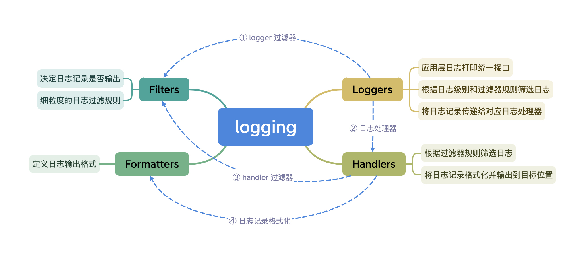

日志在开发中的地位不言而喻，规范的日志一如“书同文，车同轨”一般，不仅能灵活的进行日志搜索和过滤，更能清晰的展示业务流程，成为跨系统调用的“硬通货”。在排查线上问题时，关键日志往往能提供重要线索，帮助从一团乱麻中快速定位问题，甚至能省下数小时时间。更进一步，日志也作为系统的数据资产，从海量日志中可以分析出很多有价值的业务信息。

## Python 内置日志模块
Python 内置日志模块[[1]] `logging` 由 PEP 282 提案[[2]]引入，其最大的好处是提供了全 Python 环境统一的日志接口，使得所有 Python 模块的日志得以整合，也就是说除了记录应用本身的日志外，第三方模块的日志也可以一同记录，从而为应用提供更全面完备的日志信息。

内置日志模块按照层级结构组织[[3]]，核心包括四类组件：`loggers`，`handlers`，`filters` 和 `formatters`，它们之间的关系如下图所示：



除了根据日志级别直接进行过滤外，日志输出的主体流程分为四步（详细流程可参考[[4]]）：
1. `logger` 创建日志记录，首先根据 `logger` 过滤器规则对日志进行筛选；
2. `logger` 将筛选出的日志记录传递给对应的日志处理器 `handlers` 处理；
3. 每个 `handler` 根据其自身的过滤器规则筛选出需要处理的日志记录；
4. `handler` 将筛选出的日志记录使用 `formatter` 格式化后进行输出；

内置日志模块使用示例如下：

```Python
>>> import logging
>>>
>>> logging.basicConfig(level=logging.INFO)
>>>
>>> logger = logging.getLogger(__name__)
>>>
>>> logger.info("Hello World")
INFO:__main__:Hello World
```

## Loguru 日志框架


## 参考资料

\[1\]. [Logging facility for Python, Python Docs][1]  
\[2\]. [PEP 282 – A Logging System][2]  
\[3\]. [Advanced Logging Tutorial, Python Docs][3]  
\[4\]. [Logging Flow, Python Docs][4]  
\[5\]. [PEP 391 – Dictionary-Based Configuration For Logging][5]  

[1]: https://docs.python.org/3/library/logging.html
[2]: https://peps.python.org/pep-0282/
[3]: https://docs.python.org/3/howto/logging.html#advanced-logging-tutorial
[4]: https://docs.python.org/3/howto/logging.html#logging-flow
[5]: https://peps.python.org/pep-0391/
